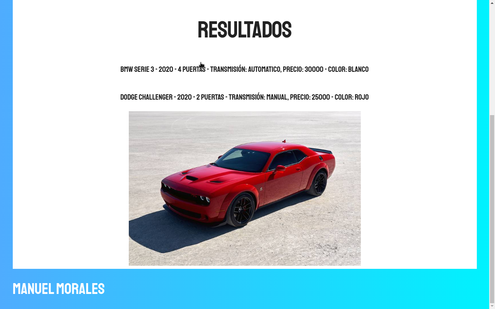

# Buscador de Automóviles con JavaScript Moderno



Una aplicación web interactiva desarrollada con **JavaScript Moderno (ES6+)** que permite a los usuarios buscar y filtrar un amplio catálogo de automóviles en tiempo real. Este proyecto simula el comportamiento de una Single Page Application (SPA) consumiendo datos asíncronos y gestionando el estado de la interfaz de manera fluida.

## 🚀 Características Principales

*   **Filtrado Multicampo:** Búsqueda avanzada por Marca, Año, Precio (Mín/Máx), Puertas, Transmisión y Color.
*   **Carga Asíncrona (Simulada):** Obtención de datos desde un archivo JSON externo (`data/autos.json`) utilizando `async/await` y la API `fetch`, con un delay intencional para simular latencia de red.
*   **Experiencia de Usuario (UI/UX) Optimizada:**
    *   **Loading State:** Animación de carga (spinner CSS) que indica al usuario que los datos se están procesando.
    *   **Control de Interacción:** Bloqueo preventivo de filtros mientras los datos están en tránsito para evitar estados inconsistentes.
    *   **Reset Global:** Botón dedicado para limpiar todos los filtros de una sola vez y restablecer el catálogo al estado inicial.
*   **Base de Datos Expandida:** Catálogo robusto que incluye desde modelos eléctricos modernos (Tesla, Hyundai Ioniq 5) hasta clásicos icónicos (Mustang '67, Ferrari F40, Mercedes 300SL).
*   **Galería Interactiva:** Visualización dinámica de imágenes al hacer clic en las especificaciones del vehículo.

## 🛠️ Tecnologías Utilizadas

*   **HTML5:** Estructura semántica.
*   **CSS3:** Estilos personalizados, gradientes y animaciones (Spinners/Loaders).
*   **Skeleton CSS:** Framework ligero para el sistema de cuadrículas (Grid) y tipografía base.
*   **JavaScript (ES6+):**
    *   `High Order Functions` (Filter, forEach, Map).
    *   Manejo avanzado del DOM.
    *   `Async/Await` y `Promises`.
    *   `Fetch API`.

## 📦 Estructura del Proyecto

```text
Buscador_Automoviles_JavaScript/
├── css/
│   ├── app.css        # Estilos principales e indicadores de carga
│   ├── normalize.css  # Reset de estilos
│   └── skeleton.css   # Framework CSS
├── data/
│   └── autos.json     # Base de datos externa de vehículos
├── img/               # Recursos de imágenes
├── js/
│   └── app.js         # Lógica principal, peticiones asíncronas y filtrado
├── index.html         # Archivo principal de la interfaz
└── README.md          # Documentación del proyecto
```

## ⚙️ Instalación y Uso Local

Este proyecto no requiere de dependencias de Node.js pesadas ni compilación.

1.  **Clonar el repositorio:**
    ```bash
    git clone https://github.com/TU_USUARIO/Buscador_Automoviles_JavaScript.git
    ```
2.  **Ejecutar mediante Live Server:**
    Debido a que el proyecto utiliza la API `fetch` para cargar el archivo `autos.json`, necesitas correrlo a través de un servidor local (abrir el `index.html` directamente en el navegador mediante el protocolo `file://` bloqueará la petición por políticas de CORS).
    *   **VS Code:** Instala la extensión "Live Server", haz clic derecho en `index.html` y selecciona "Open with Live Server".
    *   **Python:** Si tienes Python instalado, puedes abrir la terminal en la carpeta del proyecto y ejecutar `python -m http.server`.

## 👤 Autor

**Manuel Morales**
*   [LinkedIn](https://www.linkedin.com/in/manuel-esteban-morales-zuarez-68573b189/)
*   [Web](https://buscador-automoviles-manuel-morales.netlify.app)
